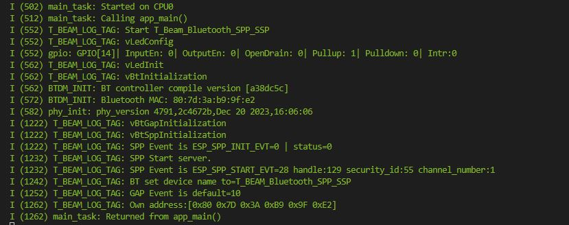
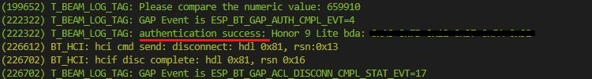

| Supported Targets | ESP32 |
| ----------------- | ----- |

# _LED Controller via Bluetooth_

This is a simple project To control a build-in LED via a classic Bluetooth communication. Since this project uses the minimum hardware requirement, it could be implimented in any board (dev or custom) that supports ESP32 chip and you can choose the LED pin that matches your needs.

### Specification
+ Board: T-Beam from LilyGo
+ SoC: ESP32
+ Flash: 4MB
+ Framework: ESP-IDF
+ LED pin: 14

### Bluetooth characteristics
+ Classic Bluetooth
+ Bluedroid (because it support Classic Bluetooth)
+ Bluetooth Basic Rate/Enhanced Data Rate (BR/EDR) only (we won't use BLE)
+ Serial Port Profile (SPP)
+ Secure Sample Pairing (SSP)

### Requirements
+ Phone or PC or any device with bluetooth to connect with our device.
+ Bluetooth application with serial communication SPP (like: [Serial Bluetooth Terminal](https://play.google.com/store/apps/details?id=de.kai_morich.serial_bluetooth_terminal&hl=en&gl=US)).

## How to use
After flashing the Firmware into the ESP32:
1. Connect to device via bluetooth (default device bluetooth name: T_BEAM_Bluetooth_SPP_SSP)
2. Use Bluetooth App with serial communication SPP to send messages to device:
    + `SET_LED_ON` to turn Led on
    + `SET_LED_OFF` to turn Led off

## How to build
Install the ESP-IDF extension in VS-Code and from there just build, flash and monitor the application.

You can use any IDE that supports ESP-IDF or use cmake as long as you know what you doing.

## Folder contents
The project **T_BEAM_BLUETOOTH_SPP_SSP** contains one source file in C language [main.c](main/main.c). The file is located in folder [main](main).

ESP-IDF projects are built using CMake. The project build configuration is contained in `CMakeLists.txt`
files that provide set of directives and instructions describing the project's source files and targets
(executable, library, or both). 

Below is short explanation of remaining files in the project folder.

```
├── CMakeLists.txt
├── main
│   ├── CMakeLists.txt
│   └── main.c
├── docs
└── README.md                  This is the file you are currently reading
```
Additionally, sdkconfig file contains all needed configuration for the ESP32 to support this project requirements (i mean, Bluetooth configuration)

## Images
> At Startup




> Connecting to Device bluetooth





> Connecting to SPP server


> Turning Led On


> Turn Led Off


